# Fetch.ai Shopping Agent - Visual Workflow Diagram

## Complete Shopping Agent Flowchart

```mermaid
flowchart TD
    A["🚀 User Query: 'buy fetch t-shirt'"] --> B["🤖 Agent Response: Show photos + sizes + prices"]
    B --> C["👤 User Selection: 'select t-shirt #2'"]
    C --> D["📝 Agent: 'Provide your details:'"]
    D --> E["📋 User Input:<br/>• Name<br/>• Address<br/>• Mobile<br/>• Password"]
    E --> F["💾 Supabase: Save order<br/>• Encrypt password<br/>• Generate Order ID<br/>• Status: Pending"]
    F --> G["💳 Razorpay: Send payment link"]
    G --> H["💰 User completes payment"]
    H --> I["✅ Supabase: Update order<br/>• Payment details<br/>• Status: Paid"]
    I --> J["📧 Send email confirmation<br/>• Order details<br/>• Tracking ID"]
    J --> K["🎉 Order Complete"]

    %% Tracking Flow
    K --> L["🔍 Tracking Phase Start"]
    L --> M["📱 User Login:<br/>Mobile + Password"]
    M --> N{"🔐 Authentication<br/>Successful?"}
    N -->|Yes| O["👋 Agent: 'Welcome back, [Name]!'"]
    N -->|No| P["❌ Invalid credentials"]
    P --> M
    O --> Q["📊 User: 'Track order' + Tracking ID"]
    Q --> R["🔍 Supabase: Fetch order details"]
    R --> S["📈 Agent: Order status + progress"]

    %% Error Handling
    H --> T{"💳 Payment<br/>Successful?"}
    T -->|Yes| I
    T -->|No| U["⚠️ Payment failed - Retry"]
    U --> G

    %% Styling
    classDef userAction fill:#e1f5fe,stroke:#01579b,stroke-width:2px
    classDef agentAction fill:#f3e5f5,stroke:#4a148c,stroke-width:2px
    classDef databaseAction fill:#e8f5e8,stroke:#1b5e20,stroke-width:2px
    classDef paymentAction fill:#fff3e0,stroke:#e65100,stroke-width:2px
    classDef errorAction fill:#ffebee,stroke:#c62828,stroke-width:2px

    class A,C,E,M,Q userAction
    class B,D,O,R,S agentAction
    class F,I databaseAction
    class G,H paymentAction
    class P,U errorAction
```

## Detailed Shopping Flow with Database Operations

```mermaid
sequenceDiagram
    participant U as 👤 User
    participant A as 🤖 Agent
    participant S as 💾 Supabase
    participant R as 💳 Razorpay
    participant E as 📧 Email Service

    Note over U,E: Phase 1: Shopping Flow
    U->>A: "I want to buy Fetch.ai T-shirt"
    A->>U: Show product photos, sizes, prices
    U->>A: "Select T-shirt #2, size M"
    A->>U: "Please provide your details"
    U->>A: Name, Address, Mobile, Password
    A->>S: Save order (password encrypted)
    S->>A: Order ID generated
    A->>R: Create payment link
    R->>U: Payment gateway
    U->>R: Complete payment
    R->>A: Payment confirmation
    A->>S: Update order status = "PAID"
    A->>E: Send confirmation email
    A->>U: Order successful + Tracking ID

    Note over U,E: Phase 2: Tracking Flow
    U->>A: Mobile + Password
    A->>S: Verify credentials
    A->>U: "Welcome back, [Name]!"
    U->>A: "Track order: TRK123456"
    A->>S: Fetch order details
    S->>A: Order status + shipment info
    A->>U: Order progress details
```

## Data Flow Architecture

```mermaid
graph LR
    subgraph "Frontend Layer"
        U[👤 User Chat Interface]
    end
    
    subgraph "Agent Layer"
        A[🤖 Shopping Agent<br/>• NLP Processing<br/>• Conversation Management<br/>• Integration Hub]
    end
    
    subgraph "Database Layer"
        S[💾 Supabase<br/>• Orders Table<br/>• Products Table<br/>• User Auth]
    end
    
    subgraph "External Services"
        R[💳 Razorpay<br/>Payment Gateway]
        E[📧 Email Service<br/>SMTP/AWS SES]
        P[📦 Product Catalog<br/>Inventory API]
    end
    
    U <--> A
    A <--> S
    A <--> R
    A <--> E
    A <--> P
    
    style A fill:#e1f5fe
    style S fill:#e8f5e8
    style R fill:#fff3e0
    style E fill:#f3e5f5
    style P fill:#fce4ec
```

## Order Status Flow

## Security & Data Protection Flow

```mermaid
flowchart TD
    A["🔐 User provides password"] --> B["🔒 Agent encrypts with bcrypt"]
    B --> C["💾 Store hash in Supabase"]
    
    D["📱 User login attempt"] --> E["🔍 Agent queries database"]
    E --> F["📊 Compare with stored hash"]
    F --> G{"✅ Hash match?"}
    G -->|Yes| H["🎉 Authentication successful"]
    G -->|No| I["❌ Access denied"]
    
    J["💰 Payment data"] --> K["🚀 Razorpay secure gateway"]
    L["📧 Email data"] --> M["🔒 OAuth2 encrypted service"]
    
    style B fill:#e8f5e8
    style H fill:#e8f5e8
    style I fill:#ffebee
    style K fill:#fff3e0
    style M fill:#e1f5fe
```

This comprehensive workflow diagram shows:
- **Complete shopping flow** from query to order completion
- **Tracking phase** with authentication
- **Data architecture** and service integrations
- **Order status progression** 
- **Security measures** for password and payment protection

The diagrams illustrate every step of your Fetch.ai merchandise shopping agent workflow!
